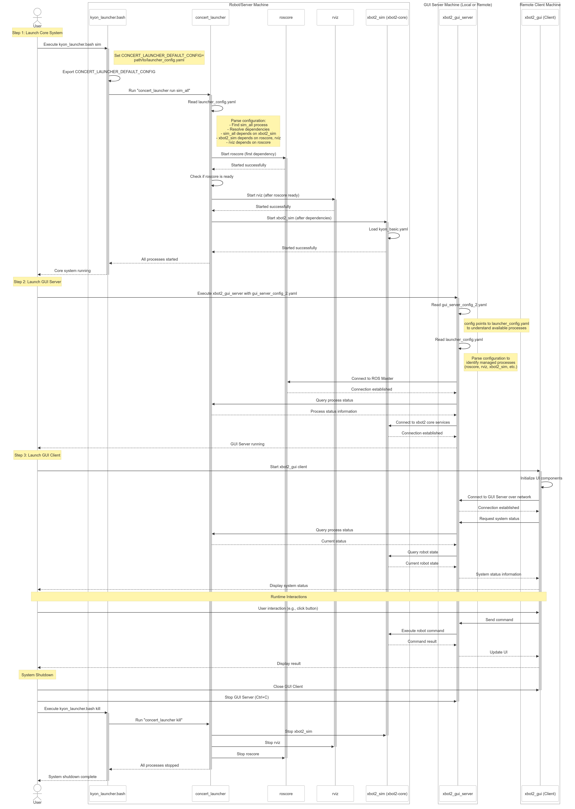
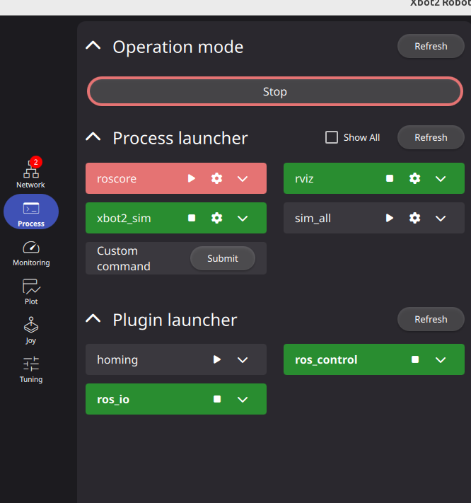

# xbot2 System Launch Guide (Using Kyon Simulation Example)

This document provides detailed instructions for launching the xbot2 system, focusing on the Kyon robot simulation example. It covers the core server/simulation components and the graphical user interface (GUI). The launch process relies heavily on ROS Noetic and the `concert_launcher` tool for managing processes.

## Table of Contents

1.  [Overall Flow](#overall-flow)
2.  [Prerequisites](#prerequisites)
3.  [Repository Structure (Kyon Example)](#repository-structure-kyon-example)
4.  [Launch Process (Step-by-Step)](#launch-process-step-by-step)
    * [Step 1: Launch Robot Model in Simulation Environment](#step-1-launch-robot-model-in-simulation-environment)
    * [Step 2: Launch Core Server / Simulation](#step-2-launch-core-server--simulation)
    * [Step 3: Launch GUI Server](#step-3-launch-gui-server)
    * [Step 4: Launch GUI Client](#step-4-launch-gui-client)
5.  [Component Roles & Interactions](#component-roles--interactions)
6.  [Process Management](#process-management)
7.  [Stopping the System](#stopping-the-system)
8.  [GUI Interface Overview](#gui-interface-overview)

## Overall Flow

The xbot2 system launch, demonstrated with the Kyon simulation, involves four main stages executed sequentially:

1.  **Launch Robot Model in Simulation:** Start the robot model in the MuJoCo simulation environment.
2.  **Start Core & Simulation:** Initiate the fundamental ROS nodes, simulation environment, and core xbot2 processes using a master launch script (`kyon_launcher.bash`). This script leverages `concert_launcher` to manage these background processes.
3.  **Start GUI Server:** Launch the backend server (`xbot2_gui_server`) responsible for interfacing between the core system state and the user-facing GUI client. This server reads configuration files to understand the system's structure and potential states.
4.  **Start GUI Client:** Run the graphical application (`xbot2_gui`) which connects to the GUI server to display information and potentially send commands.

## Prerequisites

You can set up the xbot2 system in two ways: using Docker (recommended for quick setup) or installing components manually.

### Docker Setup (Recommended for Server Components)

**Docker (Comprehensive Solution):** Using Docker is the recommended approach for setting up the xbot2 system as it eliminates the need to install and configure numerous dependencies individually.

The provided Docker containers have **all dependencies pre-installed and configured**, including:
* ROS Noetic
* xbot2 framework
* Required workspace structure
* forest package manager
* concert_launcher
* Properly configured environment variables

One of the key advantages of using Docker is that you don't need to install any of these dependencies on your host system, as they are all contained within the Docker container.

To use the Docker setup:
```bash
# Clone the repository for Docker configuration
git clone https://github.com/ADVRHumanoids/kyon_config.git
cd kyon_config/docker/kyon-cetc-focal-ros1

# Build and run the Docker container
./setup.sh
```

Refer to the Docker configuration within the `kyon_config` repository for detailed instructions: [kyon_config Docker](https://github.com/ADVRHumanoids/kyon_config/tree/master/docker/kyon-cetc-focal-ros1).

**System Dependencies:** You could need to install various system dependencies also in the Container built:
    
    ```bash
    # Terminal multiplexer required by concert_launcher
    sudo apt-get update && sudo apt-get install -y tmux
    
    # XML processing library for configuration handling
    python3 -m pip install lxml
    
    # Graphics libraries needed for visualization
    sudo apt-get update && sudo apt-get install -y libglfw3-dev
    
    # Scientific computing library for numerical operations
    pip install scipy

### GUI Client Installation (Required for Both Approaches)

The xbot2 GUI client must be installed separately on your host system, regardless of which method you use for the server components:

1. Visit the [robot_monitoring GitHub releases page](https://github.com/ADVRHumanoids/robot_monitoring/releases)
2. Download the appropriate package for your system (e.g., "Linux App" which is around 250MB)
3. Extract the downloaded package to a convenient location
4. Install the required dependency for the GUI client:
   ```bash
   # Required by robot_monitoring GUI elements
   sudo apt-get install libxcb-cursor0
   ```

### Manual Installation (Alternative for Server Components)

If you prefer not to use Docker, you can manually install all required components directly on your host system:

1.  **ROS Noetic:** The example is built upon ROS Noetic.
    * Installation: Follow the [Official ROS Noetic Installation Guide](http://wiki.ros.org/noetic/Installation).
2.  **xbot2 Workspace (`xbot2_ws`):** The core components reside within a Catkin workspace, typically named `~/xbot2_ws`. This workspace must be built using `forest`. Refer to the `forest` repository for details: [https://github.com/ADVRHumanoids/forest](https://github.com/ADVRHumanoids/forest).
3.  **Concert Launcher:** The `concert_launcher` Python package is required for managing processes. Refer to the `concert_launcher` repository for details: [https://github.com/ADVRHumanoids/concert_launcher](https://github.com/ADVRHumanoids/concert_launcher)
    * Install via pip:
        ```bash
        pip install concert_launcher
        ```
4. **System Dependencies:** You'll need to install various system dependencies:
    
    ```bash
    # Terminal multiplexer required by concert_launcher
    sudo apt-get update && sudo apt-get install -y tmux
    
    # XML processing library for configuration handling
    python3 -m pip install lxml
    
    # Graphics libraries needed for visualization
    sudo apt-get update && sudo apt-get install -y libglfw3-dev
    
    # Scientific computing library for numerical operations
    pip install scipy
    ```

## Repository Structure (Kyon Example)

This guide uses the `kyon` robot configuration as a reference example for launching xbot2 with its GUI in a MuJoCo simulation. The key repositories and components involved are structured as follows (assuming they are cloned within your `~/xbot2_ws/src`):

* **`kyon_config`**: Contains Kyon-specific configuration files and the main launch script. **Could be required for the moment to copy the launcher folder with its configuration file from this repository: [https://github.com/ADVRHumanoids/iit-kyon-ros-pkg/tree/master/kyon_config/launcher](https://github.com/ADVRHumanoids/iit-kyon-ros-pkg/tree/master/kyon_config/launcher)**
    * `launcher/kyon_launcher.bash`: The primary script for starting/managing the server/simulation.
    * `launcher/launcher_config.yaml`: Defines processes managed by `concert_launcher` for the core system (used by `kyon_launcher.bash`).
    * `launcher/gui_server_config_2.yaml`: Configuration for the `xbot2_gui_server`.
    * `kyon_basic.yaml`: Core configuration file for `xbot2-core` specific to Kyon.
    * Repository: [https://github.com/ADVRHumanoids/kyon_config](https://github.com/ADVRHumanoids/kyon_config)
* **`concert_launcher`**: The process manager tool. While typically installed via pip, understanding its configuration format might be helpful.
    * Repository: [https://github.com/ADVRHumanoids/concert_launcher](https://github.com/ADVRHumanoids/concert_launcher)
* **`xbot2_gui_server`**: The GUI backend application package. Source code might be located in `~/xbot2_ws/src/xbot2_gui_server/` or similar, depending on your `forest` setup.
* **`robot_monitoring` (contains `xbot2_gui`)**: The package containing the GUI client application (`xbot2_gui`).
    * Repository (proto branch mentioned): [https://github.com/ADVRHumanoids/robot_monitoring/tree/proto](https://github.com/ADVRHumanoids/robot_monitoring/tree/proto)

## Launch Process (Step-by-Step)

### Step 1: Launch Robot Model in Simulation Environment

When working with a simulated robot, you must first launch the robot model in the simulation environment before starting the xbot2 system.

1. **Open a Terminal:** Ensure your `xbot2_ws` is sourced (`source ~/xbot2_ws/devel/setup.bash`).
2. **Launch the MuJoCo Simulation:** Execute the following command to start the Kyon robot model in MuJoCo:

   ```bash
   roslaunch kyon_mujoco kyon_world.launch arms:=false legs:=true
   ```

   This launches the Kyon robot in the MuJoCo physics simulation with legs enabled and arms disabled. You can adjust these parameters according to your needs.

3. **Wait for Simulation to Initialize:** The MuJoCo window should appear showing the robot model. Wait until the simulation is fully initialized before proceeding to the next step.

**Keep this terminal open.**

### Step 2: Launch Core Server / Simulation

This step initializes the main backend processes, including ROS Master, RViz, and the xbot2 core/simulation.

1.  **Open a New Terminal:** Ensure your `xbot2_ws` is sourced (`source ~/xbot2_ws/devel/setup.bash`).
2.  **Run the Launcher Script:** Execute the `kyon_launcher.bash` script with the `sim` argument. Use the full path or ensure the script is executable and in your `PATH`.

    ```bash
    ~/xbot2_ws/src/kyon_config/launcher/kyon_launcher.bash sim
    ```

**What happens during this step?**

* **Environment Setup:** The script sources the main ROS Noetic environment (`/opt/ros/noetic/setup.bash`) and your workspace setup file (`~/xbot2_ws/devel/setup.bash`).
* **Dependency Check:** It verifies that the `concert_launcher` command is available.
* **Configuration Export:** It sets the `CONCERT_LAUNCHER_DEFAULT_CONFIG` environment variable to point to `launcher_config.yaml` (relative to the script's location). This tells `concert_launcher` which process configuration file to use.
* **Process Invocation (`sim` argument):**
    * The `sim` argument triggers the command: `concert_launcher run sim_all`.
    * `concert_launcher` reads the configuration file specified by `CONCERT_LAUNCHER_DEFAULT_CONFIG` (i.e., `launcher_config.yaml`).
    * It finds the `sim_all` process group definition within that file.
    * It identifies and resolves the dependencies for `sim_all`:
        * `sim_all` depends on `xbot2_sim`.
        * `xbot2_sim` depends on `roscore` and `rviz`.
        * `rviz` depends on `roscore`.
    * `concert_launcher` starts these processes in the correct dependency order:
        1.  `roscore` (The ROS Master)
        2.  `rviz` (ROS visualization tool)
        3.  `xbot2_sim` (The core `xbot2-core` process, likely running the robot simulation using `kyon_config/kyon_basic.yaml`)
    * Since `sim_all` is marked as `persistent: true` (or contains persistent processes), `concert_launcher` keeps monitoring these processes.

**Important Note on Configuration:**  
The `launcher_config.yaml` file contains the configuration for various scenarios. For the MuJoCo simulation, the typical configuration looks like:

```yaml
context:
  session: kyon_sim
  params:
    hw_type: sim

# Simulation components
roscore:
  cmd: roscore
  ready_check: rostopic list

# mujoco_sim:
#  cmd: roslaunch kyon_mujoco kyon_world.launch arms:=false legs:=true
#  depends:
#    - roscore

rviz:
  cmd: rviz
  depends:
     - roscore

xbot2_sim:
  cmd: xbot2-core --hw mj -C $(rospack find kyon_config)/kyon_basic.yaml
  ready_check: timeout 5 rostopic echo /xbotcore/joint_states -n 1
  depends:
    - roscore
    - rviz

sim_all:
  cmd: echo "Starting full simulation environment"
  persistent: true
  depends:
    - xbot2_sim
```

Note that the `mujoco_sim` section is commented out since we're launching MuJoCo manually in Step 1. The `xbot2_sim` command uses `--hw mj` to connect to the MuJoCo simulation.

If you're using a real robot instead of a simulation, you would need to modify the `xbot2_sim` command to:

```yaml
xbot2_sim:
  cmd: xbot2-core --hw dummy -C $(rospack find kyon_config)/kyon_basic.yaml
  ready_check: timeout 5 rostopic echo /xbotcore/joint_states -n 1
  depends:
    - roscore
    - rviz
```

You should see output indicating that ROS core, RViz, and the simulation are starting. **Keep this terminal open.**

### Step 3: Launch GUI Server

This step starts the backend service for the user interface.

1.  **Open a *New* Terminal:** Ensure the ROS environment and your `xbot2_ws` are sourced in this terminal as well (run `source ~/xbot2_ws/devel/setup.bash`).
2.  **Run the GUI Server:** Execute the `xbot2_gui_server` command, providing the path to its specific configuration file.

    ```bash
    xbot2_gui_server ~/xbot2_ws/src/kyon_config/launcher/gui_server_config_2.yaml
    ```

**What happens during this step?**

* The `xbot2_gui_server` process starts.
* It reads its specified configuration file (`gui_server_config_2.yaml`).
* This configuration informs the server about:
    * The dashboard layout and possible system `states` (`inactive`, `ready`, etc.).
    * Crucially, it likely references `launcher_config.yaml` (via the `launcher_config` key). This tells the GUI server *which* `concert_launcher` configuration describes the underlying system processes started in Step 2.
* The GUI server uses this information to monitor the status of processes defined in `launcher_config.yaml` (like `xbot2_sim`), possibly by interacting with ROS or `concert_launcher` itself.
* It opens a network port (typically TCP/IP on localhost, port details might be in the config or server logs) to listen for connections from the GUI Client (`xbot2_gui`).

**Keep this terminal open.**

### Step 4: Launch GUI Client

This step runs the user-facing graphical interface.

1.  **Open a *New* Terminal:** .
2.  **Navigate to the Executable:** Change directory to where the `xbot2_gui` executable is located. .
    ```bash
    cd ~/xbot2_gui_client_x86_64/bin
    ```
3.  **Run the GUI Client:** Execute the client application.
    ```bash
    ./xbot2_gui
    ```

**What happens during this step?**

* The `xbot2_gui` application (likely built from the `robot_monitoring` package) starts.
* It attempts to connect to the `xbot2_gui_server` (launched in Step 3) over the network (e.g., `localhost:port`). The server address/port might be hardcoded, configurable via arguments, or discovered through ROS (less likely).
* Once connected, it communicates with the server to:
    * Receive status information about the xbot2 system (based on the states defined in the server config and the actual status of processes managed by `concert_launcher`).
    * Display this information graphically.
    * Allow user interaction (e.g., clicking buttons) which sends commands back to the GUI server. The server then translates these into actions (e.g., calling ROS services/topics or interacting with `concert_launcher`).

The GUI window should appear, showing the status of the launched system.

## Component Roles & Interactions

* **`kyon_launcher.bash`**:
    * **Role:** Master script for initializing the core Kyon simulation system.
    * **Interaction:** Sets up the environment, invokes `concert_launcher` with specific arguments (`sim`) and configuration (`launcher_config.yaml` via env var). Provides convenience commands (`status`, `kill`, `monitor`).
* **`concert_launcher`**:
    * **Role:** Process manager. Starts, stops, and monitors background processes based on a YAML configuration.
    * **Interaction:** Reads `launcher_config.yaml`. Manages dependencies between processes (`roscore`, `rviz`, `xbot2_sim`). Executed by `kyon_launcher.bash`. Also potentially queried by `xbot2_gui_server` for process status.
* **`kyon_config` (Package)**:
    * **Role:** Provides essential configuration files (`*.yaml`) and launch scripts specific to the Kyon robot example. Centralizes setup parameters.
    * **Interaction:** Supplies configuration to `xbot2-core` (`kyon_basic.yaml`), `concert_launcher` (`launcher_config.yaml`), and `xbot2_gui_server` (`gui_server_config_2.yaml`). Contains the `kyon_launcher.bash` script.
* **`xbot2_gui_server`**:
    * **Role:** Backend service for the GUI. Bridges the core system state (managed by `concert_launcher`/ROS) and the GUI client.
    * **Interaction:** Reads its configuration (`gui_server_config_2.yaml`) and the `concert_launcher` configuration (`launcher_config.yaml`). Monitors/gathers information about processes started in Step 2. Listens for network connections from `xbot2_gui`.
* **`xbot2_gui` (from `robot_monitoring` package)**:
    * **Role:** Frontend graphical user interface. Displays system status and allows user interaction.
    * **Interaction:** Connects to `xbot2_gui_server` over the network. Requests data and sends user commands back to the server.

**Interaction Flow:**


The following diagram illustrates the typical interaction flow between the components during launch and operation:



*(Brief textual summary if needed): A typical interaction flow involves the user interacting with `xbot2_gui`, which sends requests to `xbot2_gui_server`. The server queries the state of processes managed by `concert_launcher`  and returns the status to the GUI for display. Commands from the GUI are relayed by the server to `concert_launcher`.*

## Process Management

The `kyon_launcher.bash` script wraps `concert_launcher` commands to manage the core/simulation processes started in Step 2:

* **Check Status:** See the status of processes managed by this `concert_launcher` instance:
    ```bash
    ~/xbot2_ws/src/kyon_config/launcher/kyon_launcher.bash status
    ```
* **Monitor:** Attach an interactive monitoring console (if supported by `concert_launcher`):
    ```bash
    ~/xbot2_ws/src/kyon_config/launcher/kyon_launcher.bash monitor
    ```
* **Stop All Processes:** Terminate all processes managed by this `concert_launcher` instance:
    ```bash
    ~/xbot2_ws/src/kyon_config/launcher/kyon_launcher.bash kill
    ```

## Stopping the System

Follow these steps to shut down the system cleanly:

1.  **Close the GUI Client:** Close the `xbot2_gui` window or stop its process in Terminal 4 (usually `Ctrl+C`).
2.  **Stop the GUI Server:** Stop the `xbot2_gui_server` process in Terminal 3 (usually `Ctrl+C`).
3.  **Stop Core Server/Simulation:** Use the `kill` command provided by the launcher script in Terminal 2.
    ```bash
    ~/xbot2_ws/src/kyon_config/launcher/kyon_launcher.bash kill
    ```
    This instructs `concert_launcher` to terminate `roscore`, `rviz`, `xbot2_sim`, and any other managed processes gracefully.
4.  **Stop the MuJoCo Simulation:** Return to Terminal 1 and stop the MuJoCo simulation (usually `Ctrl+C`).

## GUI Interface Overview



The xbot2 GUI interface provides a unified control panel for managing and monitoring the robot system. After completing the four-step launch process, this interface appears, offering access to various system components:

### Navigation Sidebar (Left)

The sidebar contains icons for different functional areas:
- **Network**: Connection settings and status monitoring
- **Process**: Process management (currently selected)
- **Monitoring**: System diagnostics tools
- **Plot**: Data visualization capabilities
- **Joy**: Manual control interface
- **Tuning**: Parameter adjustment tools

### Operation Mode Section

This section controls the robot's high-level state.

### Process Launcher Section

This panel displays the core processes that were launched via `concert_launcher`:

- **roscore**: The ROS master node (running, indicated by play button)
- **rviz**: Visualization tool (running, indicated by stop button)
- **xbot2_sim**: The robot simulation (running, indicated by stop button)
- **sim_all**: The process group containing all simulation components (running, indicated by play button)

Each process has control elements:
- Status indicator (play/stop button)
- Settings icon (gear) for configuration
- Dropdown menu (down arrow) for additional actions

The "Custom command" field allows entering manual commands to be executed through the system.

### Plugin Launcher Section

This section manages the xbot2 plugins that provide specific robot functionalities:

- **homing**: Plugin for joint initialization (ready to start)
- **ros_control**: ROS control interface (running)
- **ros_io**: ROS input/output communication plugin (running)
